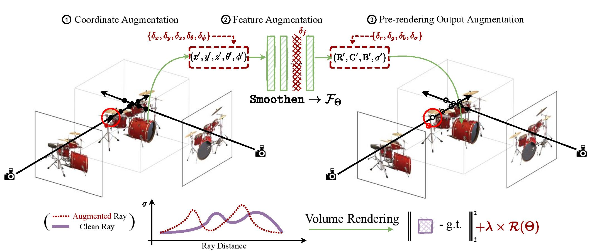

# Aug-NeRF: Training Stronger Neural Radiance Fields with Triple-Level Physically-Grounded Augmentations

[](https://opensource.org/licenses/MIT)

Official implementation of CVPR 2022 paper "Aug-NeRF: Training Stronger Neural Radiance Fields with Triple-Level Physically-Grounded Augmentations".

Tianlong Chen*, Peihao Wang*, Zhiwen Fan, Zhangyang (Atlas) Wang

## Introduction

Neural Radiance Field (NeRF) regresses a neural parameterized scene by differentially rendering multi-view images with ground-truth supervision. However, when interpolating novel views, NeRF often yields inconsistent and visually non-smooth geometric results, which we consider as a generalization gap between seen and unseen views. Recent advances in convolutional neural networks have demonstrated the promise of advanced robust data augmentations, either random or learned, in enhancing both in-distribution and out-of-distribution generalization. Inspired by that, we propose Augmented NeRF (Aug-NeRF), which for the first time brings the power of robust data augmentations into regularizing the NeRF training. Particularly, our proposal learns to seamlessly blend worst-case perturbations into three distinct levels of the NeRF pipeline with physical grounds, including (1) the input coordinates, to simulate imprecise camera parameters at image capture; (2) intermediate features, to smoothen the intrinsic feature manifold; and (3) pre-rendering output, to account for the potential degradation factors in the multi-view image supervision. Extensive results demonstrate that Aug-NeRF effectively boosts NeRF performance in both novel view synthesis (up to 1.5 dB PSNR gain) and underlying geometry reconstruction. Furthermore, thanks to the implicit smooth prior injected by the triple-level augmentations, Aug-NeRF can even recover scenes from heavily corrupted images, a highly challenging setting untackled before.



## Getting Started

### Dependency

We recommend users to use `conda` to install the running environment. The following dependencies are required:
```
pytorch=1.7.0
torchvision=0.8.0
cudatoolkit=11.0
tensorboard=2.7.0
opencv
imageio
imageio-ffmpeg
configargparse
scipy
matplotlib
tqdm
mrc
lpips
```

### Data Preparation

To run our code on NeRF dataset, users need first download data from official [cloud drive](https://drive.google.com/drive/folders/128yBriW1IG_3NJ5Rp7APSTZsJqdJdfc1). Then extract package files according to the following directory structure:
```
├── configs
│   ├── ...
│
├── datasets
│   ├── nerf_llff_data
│   │   └── fern
│   │   └── flower  # downloaded llff dataset
│   │   └── horns   # downloaded llff dataset
|   |   └── ...
|   ├── nerf_synthetic
|   |   └── lego
|   |   └── ship    # downloaded synthetic dataset
|   |   └── ...
```
The last step is to generate and process data via our provided script:
```
python gen_dataset.py --config <config_file>
```
where `<config_file>` is the path to the configuration file of your experiment instance. Examples and pre-defined configuration files are provided in `configs` folder.

Our synthetic noisy dataset will come soon ...

## Usage

### Training

After generating datasets, users can train a vanilla NeRF by the following command:
```
python run_nerf.py --gpuid <gpu_id> --expname <output_folder> --config <default_config_file>
```

To apply adversarial augmentation, users can specify the option `--adv`:
```
python run_nerf.py --gpuid <gpu_id> --expname <output_folder> --config <default_config_file>
--adv <adv types> --pgd_alpha <pgd alpha> --pgd_iters <pgd iters> --pgd_eps <pgd eps>
```
where available options include 1) Coordinate perturbation: `pts_c`, `pts_f`, `zval_c`, `zval_f`, 2) Intermediate feature perturbation: `feat_c`, `feat_f` and 3) Pre-rendering output perturbation: `raw_c`, `raw_f`. Hyper-parameters `--pgd_alpha`, `--pgd_alpha`, `--pgd_iters`, `--pgd_eps` should be specified for each type of perturbations accordingly.

### Visualization

While training, users can view logging information through `tensorboard`:
```
tensorboard --logdir='./logs' --port <your_port> --host 0.0.0.0
```

When training is done, users can evaluate and synthesize exhibition video by running:
```
python run_nerf.py --eval --eval_video --gpuid <gpu_id> --config <default_config_file>
```

To visualize geometry, users can first generate density field with flag `--eval_vol`:
```
python run_nerf.py --eval --eval_vol --gpuid <gpu_id> --config <default_config_file>
```
The exported volume will be saved into `<expname>/eval/` directory (with both `.npy` and `.mrc` suffices). Then users can use Python library [PyMCubes](https://github.com/pmneila/PyMCubes) or [USCF Chimera](https://www.cgl.ucsf.edu/chimera/) to threshold and extract meshes from the density field.

## Citation

This repository is build based on [NeRF-Pytorch](https://github.com/peihaowang/nerf-pytorch) repository.

If you find our code implementation helpful for your own resarch or work, please cite our paper.
```
@inproceedings{chen2022augnerf,
title={Aug-NeRF: Training Stronger Neural Radiance Fields with Triple-Level Physically-Grounded Augmentations},
author={Chen, Tianlong and Wang, Peihao and Fan, Zhiwen and Wang, Zhangyang},
booktitle={IEEE Conference on Computer Vision and Pattern Recognition (CVPR)},
year={2022}
}
```
